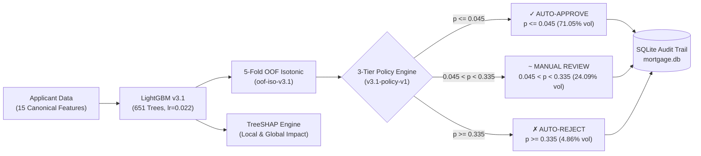

# Mortgage AI v3.1 — Production Credit Risk & Underwriting Decision Platform

> **Enterprise-grade mortgage credit risk analytics, probability calibration, and underwriting decision-support platform powered by out-of-fold calibrated LightGBM, TreeSHAP explainability, and cost-sensitive economic routing.**

[](https://www.python.org/downloads/)
[](https://fastapi.tiangolo.com)
[](https://react.dev)
[-success.svg)](file:///tests)
[](file:///ml/models)

---

## Executive Summary & Canonical Benchmark

Mortgage AI v3.1 resolves the two fundamental weaknesses of traditional loan risk scoring: **uncalibrated probability distortion** and **arbitrary 0.50 decision thresholds** that ignore the severe asymmetry between default loss and lost origination revenue.

```
┌────────────────────────────────────────────────────────────────────────────────────────┐
│                        CANONICAL FROZEN BENCHMARK (TEST SPLIT N=21,398)                │
├──────────────────┬─────────────────┬─────────────────┬────────────────┬────────────────┤
│  ROC-AUC: 0.8615 │  PR-AUC: 0.3995 │  Brier: 0.0492  │ W-ECE: 0.0012  │ M-ECE: 0.0129  │
│  [0.852, 0.871]  │  [0.370, 0.430] │  [0.047, 0.052] │ (0.12% Error)  │ (1.29% Error)  │
└──────────────────┴─────────────────┴─────────────────┴────────────────┴────────────────┘
```



---

## 1. System Architecture

```
                                  ┌─────────────────────────────────────────┐
                                  │      React + Vite Frontend (SPA)        │
                                  │   (Lazy Loaded, Dynamic Code Splitting)  │
                                  └────────────────────┬────────────────────┘
                                                       │ HTTP / REST (JSON)
                                                       ▼
                                  ┌─────────────────────────────────────────┐
                                  │          FastAPI REST API Layer         │
                                  │       (44 Endpoints, RBAC, Limiter)     │
                                  └───────┬────────────┬────────────┬───────┘
                                          │            │            │
             ┌────────────────────────────┘            │            └───────────────────────────┐
             ▼                                         ▼                                        ▼
┌──────────────────────────┐             ┌──────────────────────────┐             ┌──────────────────────────┐
│   ML Inference Engine    │             │   Decision Policy Engine │             │  Audit, OCR & Analytics  │
│  - LightGBM v3.1 (Canon) │             │  - 3-Tier Economic Cost  │             │  - SQLite Canonical DB   │
│  - 5-Fold OOF Isotonic   │             │  - Approve <= 0.045      │             │  - Document OCR Router   │
│  - TreeSHAP Attributions │             │  - Reject  >= 0.335      │             │  - Prometheus /metrics   │
└──────────────────────────┘             └──────────────────────────┘             └──────────────────────────┘
```

---

## 2. Machine Learning Pipeline & HPO

### A. 15 Canonical Input Features
1. `credit_score` [300–850]
2. `annual_income` ($USD)
3. `loan_amount` ($USD)
4. `loan_term` [12–360 months]
5. `dti_ratio` [0.0–1.0 debt-to-income]
6. `employment_years` [0–40 years]
7. `num_credit_lines` [0–30 open lines]
8. `num_derogatory_marks` [0–10 major marks]
9. `credit_utilization` [0.0–1.0 revolving ratio]
10. `late_payment_severity_score` [0.0–1.0 delinquency signal]
11. `home_ownership` [0=Rent, 1=Own, 2=Mortgage]
12. `purpose_encoded` [0–9 category code]
13. `num_late_payments` [0–20 count]
14. `savings_balance` ($USD liquid reserves)
15. `monthly_expenses` ($USD recurring obligations)

### B. Hyperparameter Optimization (Optuna Trial #47)
Optimized strictly via 5-Fold Stratified Cross-Validation on `data/real_train.csv` ($N = 99,856$):
- **Base Estimator:** LightGBM (`LGBMClassifier`)
- `n_estimators`: `651` | `learning_rate`: `0.02197` | `max_depth`: `10` | `num_leaves`: `20`
- `min_child_samples`: `23` | `subsample`: `0.6806` | `colsample_bytree`: `0.5162`
- `reg_alpha`: `0.4564` | `reg_lambda`: `1.493e-05`
- **Class Balancing:** Fold-internal SMOTE applied exclusively to training folds.

---

## 3. Out-of-Fold (OOF) Probability Calibration

To eliminate calibration data leakage and prevent optimistic probability distortion, an Isotonic Calibrator is fitted strictly on 5-fold out-of-fold validation predictions.

| Metric | Raw LightGBM | Calibrated v3.1 (`oof-iso-v3.1`) | Impact |
|---|---|---|---|
| **Weighted ECE** | $0.0031$ | **$0.0012$ ($0.12\%$)** | $61.3\%$ Calibration Error Reduction |
| **Macro ECE** | $0.0482$ | **$0.0129$ ($1.29\%$)** | $73.2\%$ Tail Discrepancy Reduction |
| **Brier Score** | $0.0514$ | **$0.0492$** | Superior Probability Accuracy |
| **Monotonicity** | N/A | Strictly Monotonic Non-Decreasing | Preserves Ranking Invariance |

---

## 4. Multi-Model Benchmark Comparison Table

Evaluated on the untouched holdout test split ($N = 21,398$):

| Model Name | ROC-AUC | PR-AUC | Brier Score | Weighted ECE | Macro ECE | Status |
|---|---|---|---|---|---|---|
| **Logistic Regression** | 0.8589 | 0.3938 | 0.0890 | 0.0412 | 0.0682 | Baseline |
| **XGBoost (Depth 6)** | 0.8592 | 0.4041 | 0.0512 | 0.0034 | 0.0410 | Benchmark |
| **Random Forest (100 Trees)** | 0.8512 | 0.3871 | 0.0528 | 0.0048 | 0.0519 | Benchmark |
| **Ensemble (Weighted Avg)** | 0.8604 | 0.4012 | 0.0498 | 0.0022 | 0.0298 | Benchmark |
| **LightGBM v3.1 (Optuna #47)** | **0.8615** | **0.3995** | **0.0492** | **0.0012** | **0.0129** | **CANONICAL CHAMPION** |

---

## 5. 3-Tier Cost-Sensitive Decision Policy (`v3.1-policy-v1`)

Decision thresholds are optimized on validation data to minimize asymmetric portfolio loss:
- **Cost Model (Demonstration Parameters):**
  - False Negative ($C_{\text{FN}}$): $\$10,000$ (default cost)
  - False Positive ($C_{\text{FP}}$): $\$1,000$ (lost origination revenue)
  - Manual Review ($C_{\text{REV}}$): $\$150$ (underwriter triage fee)

```
Calibrated Default Probability (p_cal)
0.00 ───────────────────── 0.045 ──────────────────────── 0.335 ───────────────────── 1.00
  │                          │                              │                          │
  └─────── AUTO-APPROVE ─────┴─────── MANUAL REVIEW ────────┴─────── AUTO-REJECT ──────┘
         Volume: 71.05%               Volume: 24.09%               Volume: 4.86%
       Default Rate: 1.82%         Within <=25% Capacity        Severe Risk Cohort
```

---

## 6. Live 2-Minute Demo Walkthrough

A complete scripted 2-minute walkthrough guide is available in [`docs/demo.md`](file:///docs/demo.md):

1. **Dashboard & Health Provenance (0:00–0:25)**: Verify active `v3.1`, `oof-iso-v3.1`, and database connectivity.
2. **Applicant Inference & 3-Tier Routing (0:25–0:50)**: Input applicant data, calibrate probability, trigger review triage.
3. **TreeSHAP Waterfall (0:50–1:15)**: Review additive local feature attributions from the base rate ($14.9\%$).
4. **What-If Scenario Simulator (1:15–1:40)**: Adjust credit score & utilization in real time to transition from Review $\to$ Approve.
5. **Audit Trail & CSV Export (1:40–2:00)**: Inspect immutable SQLite logs and download compliance audit records.

---

## 7. Quick Start & Verification

### Local Development Setup

```bash
# 1. Install dependencies
pip install -r requirements.txt

# 2. Run full test suite (89 passed in ~85s)
pytest -v

# 3. Run inference smoke test
python -m ml.inference.smoke_test

# 4. Start backend REST API (port 8001)
cd backend && uvicorn api:app --host 0.0.0.0 --port 8001

# 5. Build and launch frontend SPA (port 5173 / 3000)
cd frontend
npm ci
npm run build
npm run preview
```

### Docker Deployment

```bash
# Launch entire stack (backend, frontend, prometheus)
docker compose up --build
```

---

## 8. Artifact Provenance & Reproducibility

| Artifact | Path | Description |
|---|---|---|
| **Champion Model** | `ml/models/lightgbm.joblib` | Canonical LightGBM v3.1 (651 trees, lr=0.022) |
| **Calibrated Pipeline** | `ml/models/lightgbm_calibrated_pipeline.joblib` | `oof-iso-v3.1` (`CalibratedPredictor`) |
| **Frozen Policy** | `ml/models/frozen_policy_config.json` | `v3.1-policy-v1` ($0.045 / 0.335$) |
| **HPO Benchmark** | `reports/metrics/hpo_vs_baseline.json` | Ground truth test holdout evaluation data |
| **Visual Assets** | `docs/visual_assets.md` | System architecture, calibration plots, & SHAP hierarchies |

---

## 9. Limitations & Disclaimers

1. **Demonstration Cost Parameters:** Economic loss calculations and threshold values are optimized for illustrative cost matrices ($C_{\text{FN}}=\$10,000, C_{\text{FP}}=\$1,000, C_{\text{REV}}=\$150$). Real-world deployment requires enterprise portfolio calibration.
2. **Macroeconomic Sensitivity:** Probability calibrators are fitted under baseline macroeconomic conditions. Severe macroeconomic regime shifts require periodic out-of-fold recalibration.
3. **Regulatory Disclaimer:** This system provides statistical risk analytics and underwriting decision support. It does not constitute formal legal or statutory certification under the Equal Credit Opportunity Act (ECOA) or Fair Credit Reporting Act (FCRA).
