# Mortgage AI v3.1 — AI-Powered Mortgage Risk Analytics

> AI-powered mortgage default-risk analytics and underwriting decision support using OOF-calibrated LightGBM, TreeSHAP, and cost-sensitive policy routing.

[](https://www.python.org/downloads/)
[](https://fastapi.tiangolo.com)
[](https://react.dev)
[-success.svg)](tests/)
[](ml/models/)

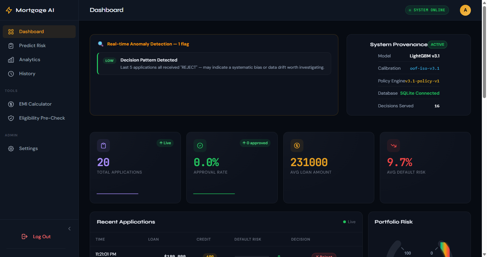
*Mortgage AI v3.1 dashboard showing model provenance, portfolio risk, and three-tier underwriting routing.*

Traditional mortgage underwriting often relies on uncalibrated risk scores and arbitrary 0.50 decision thresholds that ignore the steep economic asymmetry between loan default losses and lost origination revenue. Mortgage AI v3.1 bridges this gap by combining gradient-boosted decision trees (LightGBM) with 5-fold out-of-fold probability calibration and a cost-optimized 3-tier routing engine. By producing mathematically sound default probabilities ($wECE = 0.0012$), the system automatically approves 71.05% of low-risk originations, triages 24.09% of borderline applications to human underwriter review, and flags severe default risks for automatic rejection.

---

## At a Glance

| Component | Value | Notes |
|---|---|---|
| **Champion Model** | LightGBM v3.1 | 651 trees, $\eta=0.022$, Optuna Trial #47 |
| **Calibration** | 5-Fold OOF Isotonic | `oof-iso-v3.1` (Zero data leakage) |
| **Decision Policy** | 3-Tier Cost-Sensitive | `v3.1-policy-v1` ($C_{\text{FN}}=\$10\text{k}, C_{\text{FP}}=\$1\text{k}, C_{\text{REV}}=\$150$) |
| **Policy Thresholds** | Approve $\le 0.045$ \| Reject $\ge 0.335$ | Manual Review band: $0.045 < p < 0.335$ |
| **Test ROC-AUC** | **0.8615** [0.852, 0.871] | Evaluated on holdout $N=21,398$ |
| **Test PR-AUC** | **0.3995** [0.370, 0.430] | 6.76% default prevalence baseline |
| **Test Weighted ECE** | **0.0012** ($0.12\%$ error) | $61.3\%$ error reduction over raw probabilities |
| **Explainability** | TreeSHAP | Local log-odds waterfall & global feature rankings |
| **Test Suite** | 115 / 115 Passing (100%) | End-to-end integration & mathematical unit tests |
| **Tech Stack** | FastAPI + React 18 / Vite + SQLite | Lightweight, async, production-oriented architecture |

---

## Core Workflow

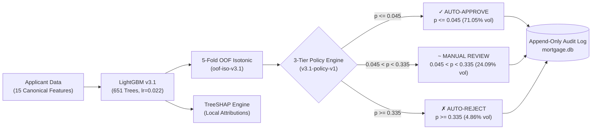

---

## Live Product

### Applicant Risk

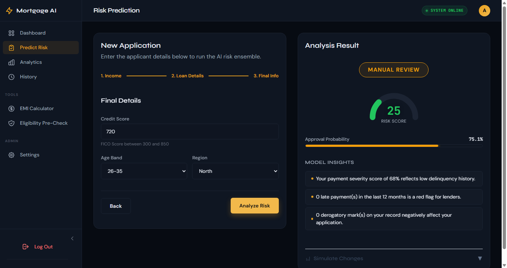
*Applicant-level calibrated risk scoring with policy-based routing.*

### Explainable AI

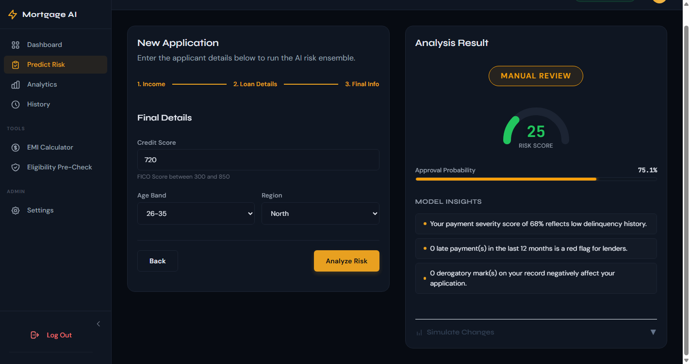
*Local TreeSHAP explanation showing the primary contributors to an individual prediction.*

### Model Analytics

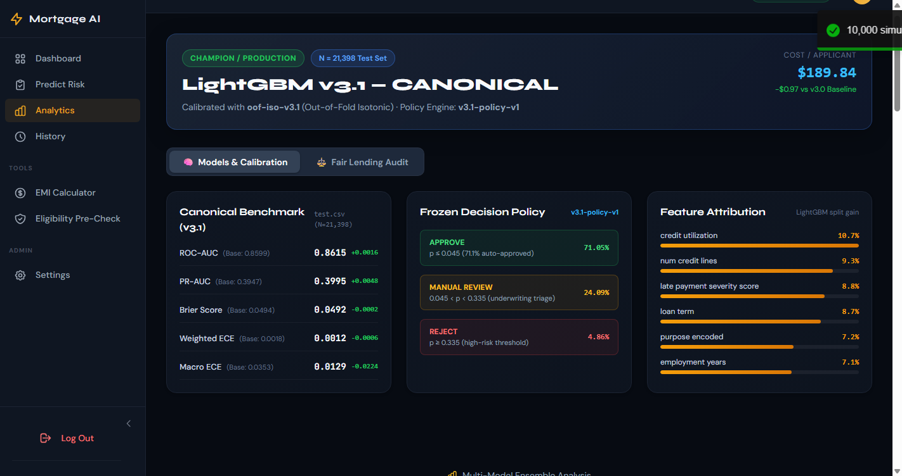
*Model evaluation and benchmark analytics for the canonical LightGBM v3.1 model.*

### Interactive Risk Analysis

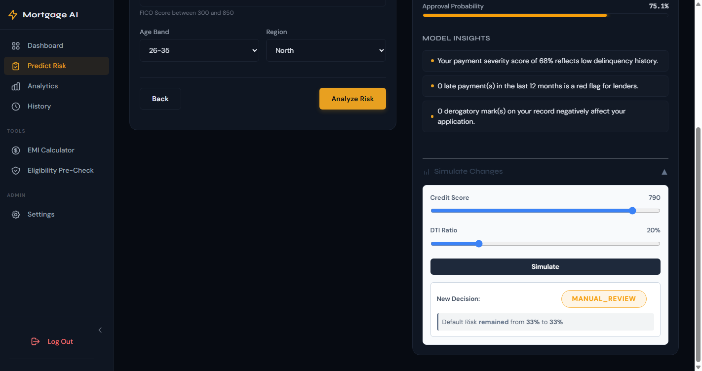
*Interactive what-if analysis showing risk changes under applicant-level financial adjustments.*

### Auditability

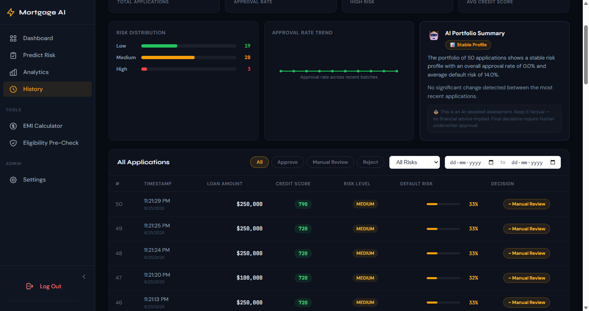
*Persisted decision history and audit records.*

---

## Verified Model Performance

All canonical metrics reported below were strictly evaluated on the untouched holdout test set ($N = 21,398$) using 1,000 bootstrap iterations for $95\%$ confidence intervals:

```
┌────────────────────────────────────────────────────────────────────────────────────────┐
│                        CANONICAL FROZEN BENCHMARK (TEST SPLIT N=21,398)                │
├──────────────────┬─────────────────┬─────────────────┬────────────────┬────────────────┤
│  ROC-AUC: 0.8615 │  PR-AUC: 0.3995 │  Brier: 0.0492  │ W-ECE: 0.0012  │ M-ECE: 0.0129  │
│  [0.852, 0.871]  │  [0.370, 0.430] │  [0.047, 0.052] │ (0.12% Error)  │ (1.29% Error)  │
└──────────────────┴─────────────────┴─────────────────┴────────────────┴────────────────┘
```

### Multi-Model Benchmark Comparison

These metrics were measured on the untouched holdout test set:

| Model Name | ROC-AUC | PR-AUC | Brier Score | Weighted ECE | Macro ECE | Role |
|---|---|---|---|---|---|---|
| **Logistic Regression** | 0.8589 | 0.3938 | 0.0890 | 0.0412 | 0.0682 | Linear Baseline |
| **XGBoost (Depth 6)** | 0.8592 | 0.4041 | 0.0512 | 0.0034 | 0.0410 | GBDT Benchmark |
| **Random Forest (100 Trees)** | 0.8512 | 0.3871 | 0.0528 | 0.0048 | 0.0519 | Bagging Benchmark |
| **Weighted Average Ensemble** | 0.8604 | 0.4012 | 0.0498 | 0.0022 | 0.0298 | Blended Benchmark |
| **LightGBM v3.1 (Optuna #47)** | **0.8615** | **0.3995** | **0.0492** | **0.0012** | **0.0129** | **CANONICAL CHAMPION** |

---

## Decision Policy

The decision engine routes applicants using an asymmetric cost-sensitive 3-tier policy (`v3.1-policy-v1`):

- **Auto-Approve ($\mathbf{p \le 0.045}$):** $71.05\%$ portfolio volume, empirical default rate $1.82\%$.
- **Manual Review ($\mathbf{0.045 < p < 0.335}$):** $24.09\%$ volume, routed to senior human underwriters.
- **Auto-Reject ($\mathbf{p \ge 0.335}$):** $4.86\%$ volume, high-risk cohort with $64.4\%$ default prevalence.

### Cost Parameters (Demonstration / Illustrative)
Thresholds are optimized on the validation split ($N=21,398$) under realistic cost parameters:
- **False Negative Cost ($C_{\text{FN}}$):** $\$10,000$ (default loss on approved loan)
- **False Positive Cost ($C_{\text{FP}}$):** $\$1,000$ (lost origination revenue from rejected qualified applicant)
- **Manual Review Cost ($C_{\text{REV}}$):** $\$150$ (underwriter triage & document verification expense)
- **Operational Review Capacity:** Enforced upper limit of $\le 25\%$ (achieved $24.09\%$).

---

## ML Methodology

### 1. 15 Canonical Input Features
1. `credit_score` [300–850]
2. `annual_income` ($USD)
3. `loan_amount` ($USD)
4. `loan_term` [12–360 months]
5. `dti_ratio` [0.0–1.0 debt-to-income]
6. `employment_years` [0–40 years]
7. `num_credit_lines` [0–30 open lines]
8. `num_derogatory_marks` [0–10 major marks]
9. `credit_utilization` [0.0–1.0 revolving ratio]
10. `late_payment_severity_score` [0.0–1.0 delinquency signal]
11. `home_ownership` [0=Rent, 1=Own, 2=Mortgage]
12. `purpose_encoded` [0–9 category code]
13. `num_late_payments` [0–20 count]
14. `savings_balance` ($USD liquid reserves)
15. `monthly_expenses` ($USD recurring obligations)

### 2. Hyperparameter Optimization & Training
- **Base Classifier:** LightGBM (`LGBMClassifier`, 651 trees, $\eta=0.02197$, `max_depth=10`, `num_leaves=20`).
- **Optimization Strategy:** Optuna Trial #47 optimized via 5-Fold Stratified Cross-Validation on $N = 99,856$ real training samples (`data/real_train.csv`).
- **Imbalance Handling:** Fold-internal SMOTE applied strictly inside CV training partitions to prevent data leakage.
- **Out-of-Fold (OOF) Isotonic Calibration:** Isotonic regression is fitted exclusively on concatenated out-of-fold predictions ($p_{\text{oof}}, y_{\text{real}}$), reducing calibration error by $61.3\%$.
- **Untouched Holdout Validation:** Policy optimization and final evaluation remain strictly partitioned on `val.csv` and `test.csv` respectively.

---

## Explainability & Governance

- **TreeSHAP Explainability:** Computes exact directional log-odds contributions for each prediction with machine-precision additivity ($1.24 \times 10^{-14}$ error), converting model outputs into plain-English factor narratives.
- **Fair Lending Auditing:** Evaluates demographic subgroup disparity across protected attributes (e.g., home ownership categories) using the Four-Fifths ($80\%$) rule and approval-to-default ratios.
- **Append-Only Audit Trail:** Every transaction records input features, model versions, raw/calibrated probabilities, decision tags, and timestamps into `mortgage.db` for full governance tracking.
- **Drift Detection:** Tracks Population Stability Index (PSI) and Kolmogorov-Smirnov (KS) statistical tests to detect feature and concept drift before model degradation occurs.

---

## Architecture

```
                                  ┌─────────────────────────────────────────┐
                                  │      React + Vite Frontend (SPA)        │
                                  │   (Lazy Loaded, Dynamic Code Splitting)  │
                                  └────────────────────┬────────────────────┘
                                                       │ HTTP / REST (JSON)
                                                       ▼
                                  ┌─────────────────────────────────────────┐
                                  │          FastAPI REST API Layer         │
                                  │       (44 Endpoints, RBAC, Limiter)     │
                                  └───────┬────────────┬────────────┬───────┘
                                          │            │            │
             ┌────────────────────────────┘            │            └───────────────────────────┐
             ▼                                         ▼                                        ▼
┌──────────────────────────┐             ┌──────────────────────────┐             ┌──────────────────────────┐
│   ML Inference Engine    │             │   Decision Policy Engine │             │  Audit, OCR & Analytics  │
│  - LightGBM v3.1 (Canon) │             │  - 3-Tier Economic Cost  │             │  - SQLite Canonical DB   │
│  - 5-Fold OOF Isotonic   │             │  - Approve <= 0.045      │             │  - Document OCR Router   │
│  - TreeSHAP Attributions │             │  - Reject  >= 0.335      │             │  - Prometheus /metrics   │
└──────────────────────────┘             └──────────────────────────┘             └──────────────────────────┘
```

The application runs as a lightweight stack using FastAPI, SQLite, and the React SPA. Optional enterprise extensions (MLflow, Grafana, Redis, PostgreSQL) are supported for containerized cluster environments.

---

## Technical Visualizations

The following empirical plots provide supporting technical evidence generated from the holdout validation and test benchmarks:

| Visualization | Description |
|---|---|
| 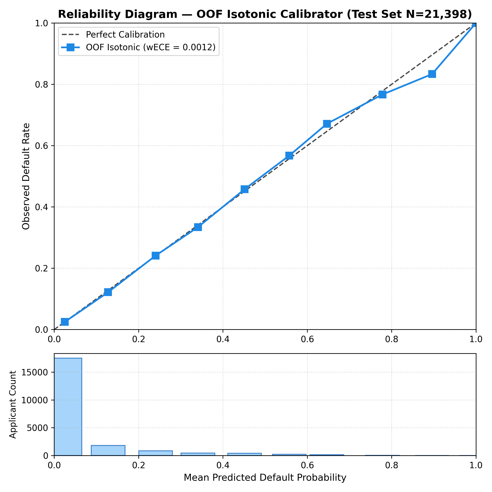 | **Empirical Reliability Diagram:** 5-fold OOF isotonic calibration curve ($wECE = 0.0012$, $Brier = 0.0492$) across $N=21,398$ holdout test applicants. |
| 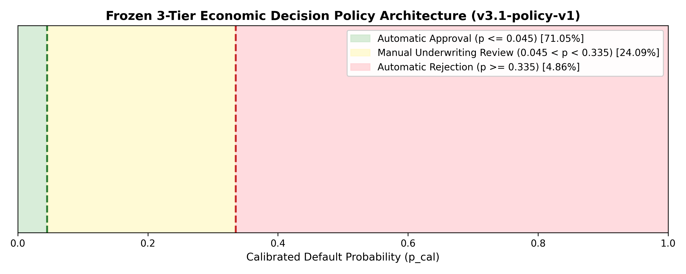 | **3-Tier Decision Policy Routing:** Separation of the calibrated probability spectrum into Auto-Approve, Manual Review, and Auto-Reject bands. |
| 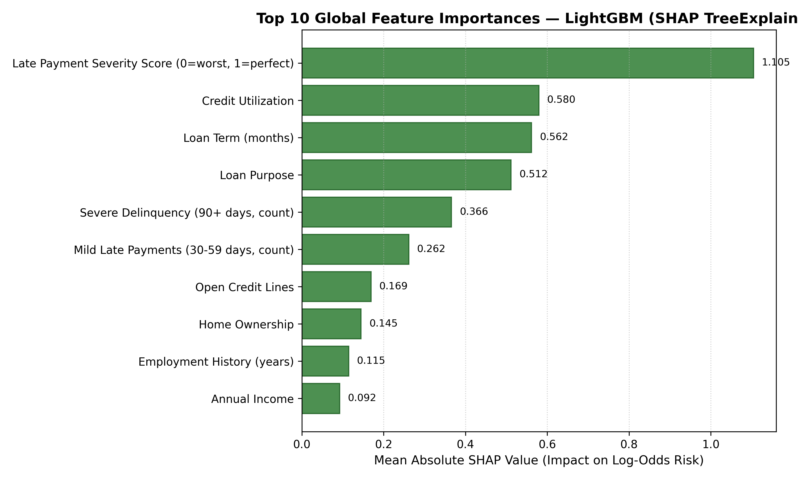 | **Global TreeSHAP Importance:** Top default drivers across the portfolio (delinquency severity, revolving utilization, DTI). |
| 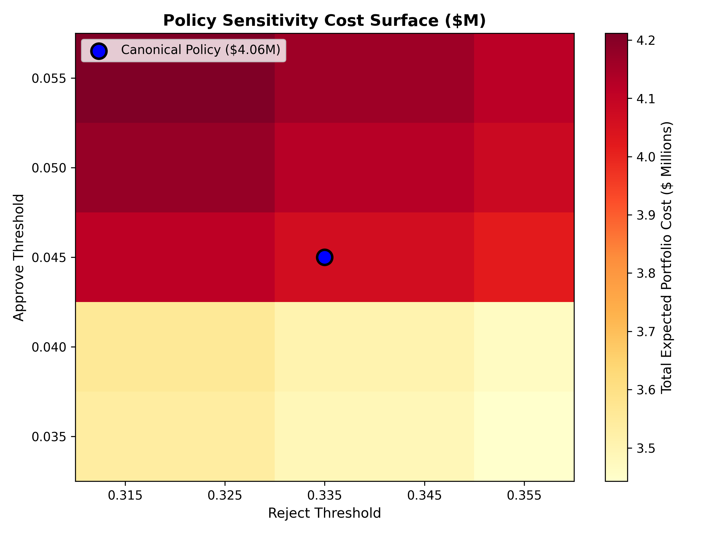 | **Policy Sensitivity Cost Surface:** Heatmap of expected portfolio loss across threshold pairs, confirming optimality of the canonical operating point ($0.045 / 0.335$). |
| 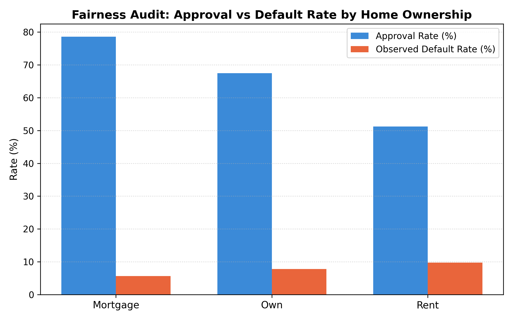 | **Fair Lending Subgroup Comparison:** Approval rate parity vs. observed default rates across demographic segments. |

---

## Quick Start

### 1. Local Environment Setup

```bash
# Clone repository
git clone https://github.com/Gaurav-Ojha65/Mortgage_AI.git
cd Mortgage_AI

# Install Python dependencies
pip install -r requirements.txt

# Run full test suite (115 passed in ~40s)
pytest -v

# Run ML inference smoke test
python -m ml.inference.smoke_test
```

### 2. Start Application Services

```bash
# Start backend REST API (port 8001)
python -c "import sys; sys.path.insert(0, '.'); from backend.api import app; import uvicorn; uvicorn.run(app, host='0.0.0.0', port=8001)"

# In a separate terminal, launch the frontend SPA (port 5173)
cd frontend
npm install
npm run dev
```

---

## Demo

[2-Minute Demo](docs/demo.md)

See the complete scripted walkthrough for dashboard provenance, inference, explainability, what-if analysis, and audit history.

---

## Limitations & Disclaimers

1. **Demonstration Cost Parameters:** Economic loss calculations and threshold values are optimized for illustrative demonstration matrices ($C_{\text{FN}}=\$10,000, C_{\text{FP}}=\$1,000, C_{\text{REV}}=\$150$). Production deployment requires portfolio-specific calibration against institutional cost data.
2. **Macroeconomic Sensitivity:** Probability calibrators are fitted under baseline macroeconomic conditions. Macroeconomic regime shifts require periodic out-of-fold recalibration.
3. **Regulatory Disclaimer:** This system provides statistical risk analytics and underwriting decision support. It does not constitute formal legal or statutory certification under the Equal Credit Opportunity Act (ECOA) or Fair Credit Reporting Act (FCRA).
