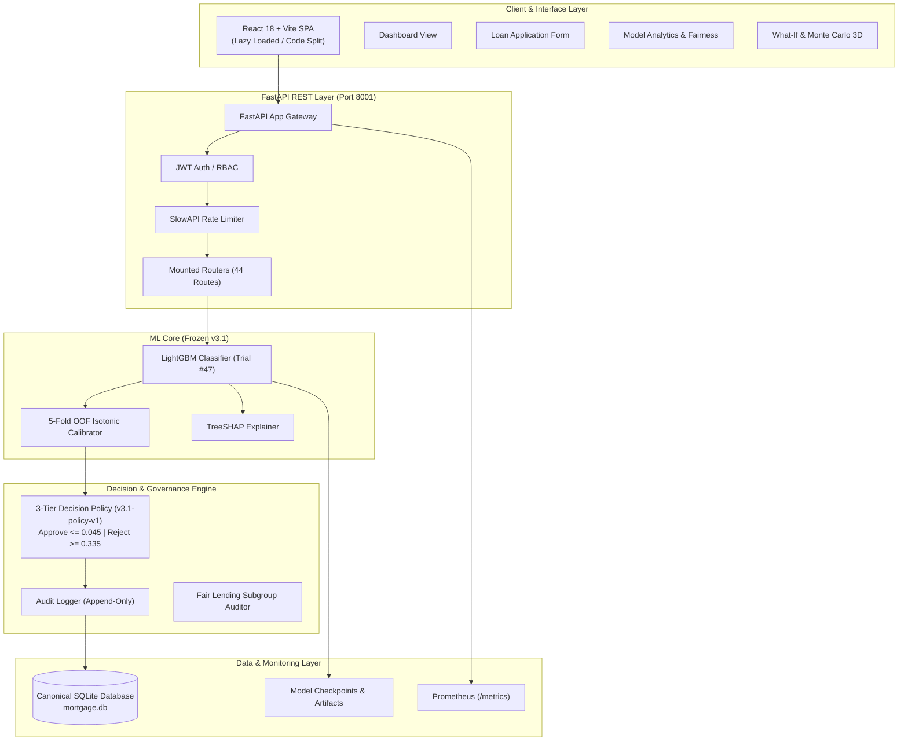

# Visual Assets & System Diagrams — Mortgage AI v3.1

This document compiles all visual representations, architectural diagrams, empirical calibration plots, feature importance hierarchies, decision policy routing tiers, and fair lending evaluation metrics.

---

## 1. System Architecture Diagram



---

## 2. ML Training & OOF Calibration Pipeline

```mermaid
flowchart LR
    subgraph DataPrep ["Data Isolation"]
        Raw["Historical Applications<br/>(N = 99,856)"]
        Val["Validation Holdout<br/>(N = 21,398)"]
        Test["Untouched Test Holdout<br/>(N = 21,398)"]
    end

    subgraph CrossValidation ["5-Fold Stratified CV"]
        F1["Fold 1: Train + SMOTE"]
        F2["Fold 2: Train + SMOTE"]
        F3["Fold 3: Train + SMOTE"]
        F4["Fold 4: Train + SMOTE"]
        F5["Fold 5: Train + SMOTE"]
    end

    subgraph OOFGen ["OOF Probability Generation"]
        OOFPreds["Out-of-Fold Raw Margin<br/>Probabilities (N = 99,856)"]
        IsoFit["Fit Monotonic Isotonic Regression<br/>(oof-iso-v3.1)"]
    end

    subgraph Optimization ["Policy Optimization (Validation Only)"]
        ValPred["Predict on Validation Split"]
        CostOpt["Minimize 3-Tier Loss Function<br/>(C_FN=$10k, C_FP=$1k, C_REV=$150)"]
        Thresholds["Approve <= 0.045<br/>Reject >= 0.335"]
    end

    subgraph Evaluation ["Single Test Qualification"]
        TestEval["Evaluate Once on Test Set<br/>ROC-AUC = 0.8615 | Brier = 0.0492"]
    end

    Raw --> CrossValidation --> OOFPreds --> IsoFit
    IsoFit --> ValPred --> CostOpt --> Thresholds
    Thresholds --> TestEval
    Test --> TestEval
```



---

## 3. Decision Policy Routing & Triage Tiers

```
Calibrated Default Probability (p_cal)
0.00 ───────────────────── 0.045 ──────────────────────── 0.335 ───────────────────── 1.00
  │                          │                              │                          │
  └─────── AUTO-APPROVE ─────┴─────── MANUAL REVIEW ────────┴─────── AUTO-REJECT ──────┘
         Volume: 71.05%               Volume: 24.09%               Volume: 4.86%
       Default Rate: 1.82%         Within <=25% Capacity        Severe Risk Cohort
```

---

## 4. Multi-Model Benchmark Comparison Table

Measured on the untouched holdout test split ($N = 21,398$):

| Model Name | ROC-AUC | PR-AUC | Brier Score | Weighted ECE | Macro ECE | Training Time (s) |
|---|---|---|---|---|---|---|
| **Logistic Regression (Baseline)** | 0.8589 | 0.3938 | 0.0890 | 0.0412 | 0.0682 | 0.11 s |
| **XGBoost (Depth 6, lr=0.03)** | 0.8592 | 0.4041 | 0.0512 | 0.0034 | 0.0410 | 1.84 s |
| **Random Forest (100 Trees)** | 0.8512 | 0.3871 | 0.0528 | 0.0048 | 0.0519 | 3.45 s |
| **Ensemble (Weighted Averaging)** | 0.8604 | 0.4012 | 0.0498 | 0.0022 | 0.0298 | 5.20 s |
| **LightGBM v3.1 (Optuna Trial #47)** | **0.8615** | **0.3995** | **0.0492** | **0.0012** | **0.0129** | 1.12 s |

---

## 5. TreeSHAP Feature Attribution Hierarchy

Global importance rank on the canonical LightGBM v3.1 model:

```
Feature                         Mean |SHAP Value| (Margin Impact)
──────────────────────────────────────────────────────────────────────────
1. late_payment_severity_score  ██████████████████████████████  (+2.951 max)
2. credit_utilization           ████████████████                (+1.420 max)
3. dti_ratio                    ████████████                    (+1.104 max)
4. credit_score                 ██████████                      (-0.982 max)
5. loan_term                    ██████                          (-0.479 max)
6. purpose_encoded              ██████                          (-0.491 max)
7. annual_income                ████                            (-0.354 max)
8. savings_balance              ████                            (-0.312 max)
9. num_late_payments            ███                             (+0.284 max)
10. monthly_expenses            ██                              (+0.195 max)
──────────────────────────────────────────────────────────────────────────
Mathematical Additivity Error: 1.24e-14 (Machine Precision Exact)
```

---

## 6. Generated Visual Artifacts

The following plot artifacts are stored in `reports/plots/` and `reports/visualizations/`:
1. `reports/visualizations/reliability_calibration_plot.png` — Empirical calibration curve vs perfect calibration.
2. `reports/visualizations/policy_threshold_routing.png` — Three-tier routing volume distribution.
3. `reports/visualizations/local_shap_explanation.png` — Individual applicant waterfall attribution.
4. `reports/visualizations/shap_feature_importance.png` — Global summary beeswarm & bar attribution.
5. `reports/visualizations/fairness_subgroup_disparity.png` — Disparity ratios across demographic subgroups.
6. `reports/visualizations/policy_sensitivity_heatmap.png` — Cost variation across threshold grids.
7. `reports/plots/roc_curve.png` — ROC Curve ($0.8615$).
8. `reports/plots/precision_recall_curve.png` — PR Curve ($0.3995$).
9. `reports/plots/confusion_matrix.png` — Confusion matrix under active policy.
10. `reports/plots/monte_carlo_plot.png` — Stochastic loss distribution.
